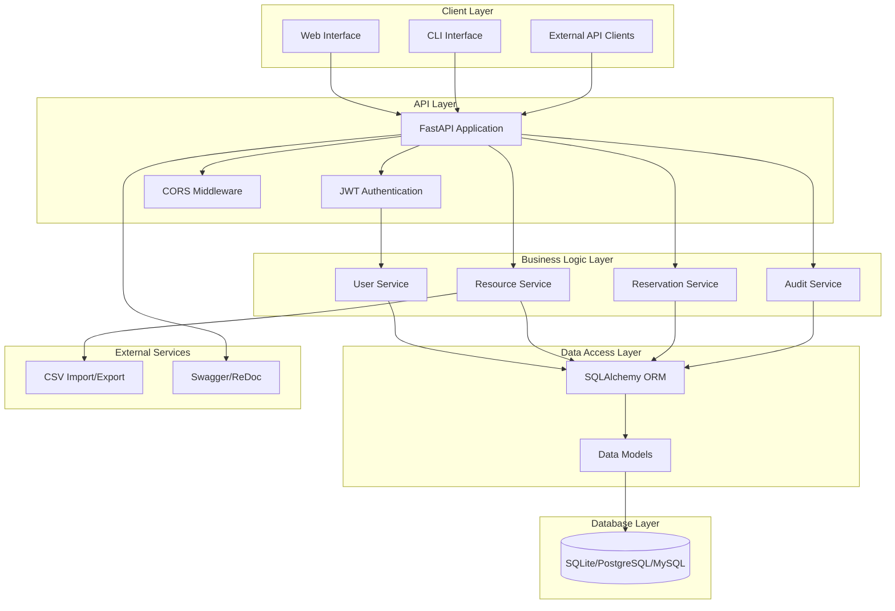

# Resource Reservation System

A comprehensive resource management platform designed for enterprise environments to efficiently manage shared resources, facilities, and equipment through automated scheduling and conflict resolution.

[](LICENSE)
[](https://www.python.org/)
[](https://fastapi.tiangolo.com/)
[](https://typer.tiangolo.com/)
[](http://localhost:8000/docs)

## Table of Contents

- [Overview](#overview)
- [Features](#features)
- [Requirements](#requirements)
- [Architecture](#architecture)
- [Installation](#installation)
- [Configuration](#configuration)
- [API Reference](#api-reference)
- [Web Interface](#web-interface)
- [Command Line Interface](#command-line-interface)
- [Security](#security)
- [Deployment](#deployment)
- [Contributing](#contributing)
- [License](#license)

## Overview

The Resource Reservation System is a scalable API + CLI tool that helps organizations manage and schedule shared resources such as meeting rooms or lab equipment. It ensures conflict-free bookings, keeps a complete audit trail, and provides a modern command-line experience.

## Features

### Core Features

- 🔐 **JWT Authentication & Authorization**
- 🗂️ **Tag-Based Resource Management**
- 📅 **Smart Booking System with Conflict Detection**
- 📊 **Complete Audit Trail**
- 📥 **CSV Bulk Resource Import**
- 🖥️ **Modern Typer CLI with Rich Output**
- 🌐 **RESTful API with Swagger/OpenAPI Docs**
- 🌍 **CORS-Enabled for Web Integration**

### Web Interface Features

- **User Authentication & Registration**
- **Resource Management** - View and manage all available resources
- **Reservation System** - Book and manage your reservations
- **Upcoming Reservations** - Keep track of your upcoming bookings
- **Responsive Design** - Works on both desktop and mobile devices

## Requirements

### Functional Requirements

- User registration and authentication with secure credential management
- Resource creation and management with tag-based categorization
- Reservation booking with conflict detection and prevention
- Reservation cancellation and modification capabilities
- Search functionality for resources by tags and availability
- Bulk resource import via CSV files with preview capabilities
- Audit trail for all user actions and system changes
- User-specific reservation viewing and management
- Real-time availability checking for specified time ranges
- Command-line interface for all system operations

### Non-Functional Requirements

- **Performance**: System must handle concurrent users efficiently
- **Security**: JWT-based authentication with bcrypt password hashing
- **Scalability**: Database switchable from SQLite to PostgreSQL/MySQL for production
- **Availability**: RESTful API with comprehensive error handling
- **Usability**: Intuitive web interface and modern CLI with rich output formatting
- **Maintainability**: Auto-generated API documentation with Swagger/OpenAPI
- **Compatibility**: Python 3.7+ support with cross-platform deployment
- **Data Integrity**: Conflict-checked time slots with complete validation

## Architecture

### Technical Stack

**Framework**: FastAPI (Python 3.7+)
**Database**: SQLite (switchable to PostgreSQL/MySQL)
**Auth**: JWT
**Docs**: Auto-generated Swagger / ReDoc

### Data Models

- **Users**: Secure credentials, login history
- **Resources**: Categorized by tags and availability
- **Reservations**: Conflict-checked time slots
- **Audit Logs**: User actions and changes with timestamps

### System Architecture



## Installation

### Prerequisites

- Python 3.7+
- `pip` installed
- SQLite (default)

### Setup Instructions

```bash
git clone https://github.com/sylvester-francis/Resource-Reserver.git
cd Resource-Reserver
python -m venv venv
source venv/bin/activate  # or venv\Scripts\activate on Windows
pip install -r requirements.txt
cp .env.example .env  # Edit as needed
python -m app.database  # Initialize DB
```

### Run the App

```bash
uvicorn app.main:app --reload
# Visit: http://localhost:8000/docs
```

## Configuration

`.env` example:

```env
DATABASE_URL=sqlite:///./reservations.db
SECRET_KEY=your-secret-key
ALGORITHM=HS256
ACCESS_TOKEN_EXPIRE_MINUTES=30
API_URL=http://localhost:8000
```

## API Reference

### Authentication

- `POST /register` - Register new user  
- `POST /token` - Login and get token

### Resources

- `POST /resources` - Create resource  
- `GET /resources` - List all  
- `GET /resources/search` - Filter by tags or time  
- `POST /resources/upload` - Bulk upload (CSV)

### Reservations

- `POST /reservations` - Book a resource  
- `GET /reservations/my` - View user's bookings  
- `POST /reservations/{id}/cancel` - Cancel  
- `GET /reservations/{id}/history` - Track changes

### System

- `GET /health` - Health check

## Web Interface

### Running the Web Interface

1. Start the FastAPI backend (in one terminal):

   ```bash
   uvicorn app.main:app --reload
   ```

2. In a new terminal, navigate to the project root directory and start a simple HTTP server:

   ```bash
   # Python 3.x
   python -m http.server 3000 --directory web
   ```

3. Open your browser and visit: <http://localhost:3000/web>

## Command Line Interface

Built with **Typer**, the CLI offers an intuitive, emoji-enhanced interface.

### CLI Highlights

- 🔐 Secure authentication (login/logout/status)
- 🧾 Resource operations (list, create, search, bulk upload)
- 📆 Reservation control (book, cancel, view history)
- ⌛ Smart availability search with conflict detection
- 📦 CSV support with preview and error highlighting
- 🧠 Audit logs with full traceability

### Authentication

```bash
python -m cli.main auth register
python -m cli.main auth login
python -m cli.main auth status
python -m cli.main auth logout
```

### Resource Management

```bash
python -m cli.main resources list --details
python -m cli.main resources search --query "conference" --from "2025-06-07 09:00" --until "2025-06-07 17:00"
python -m cli.main resources create "Conference Room A" --tags "meeting,conference"
python -m cli.main resources upload resources.csv --preview
```

### Reservations

```bash
python -m cli.main reservations create 1 "2025-06-07 14:00" "2h"
python -m cli.main reservations list --upcoming --detailed
python -m cli.main reservations cancel 2 --reason "Meeting cancelled"
python -m cli.main reservations history 2 --detailed
```

### Quick Actions

```bash
python -m cli.main reserve 1 "2025-06-07 14:00" "2h"
python -m cli.main upcoming
```

### System Status

```bash
python -m cli.main system status
python -m cli.main system config
```

## Security

### Security Features

- ✅ **bcrypt** password hashing  
- ✅ **JWT** for secure sessions  
- ✅ **Pydantic** for strict validation  
- ✅ **SQLAlchemy** ORM (safe from injection)  
- ✅ **CORS** headers  
- ✅ **User-scoped access controls**

## Deployment

### Deployment Tips

- Run with Gunicorn & Uvicorn workers  
- Use PostgreSQL or MySQL in prod  
- Set a strong `SECRET_KEY`  
- Serve over HTTPS  
- Enable logging, monitoring, and rate limiting

## Contributing

1. Fork this repo  
2. Create a branch `git checkout -b feature/YourFeature`  
3. Commit `git commit -m 'feat: Add YourFeature'`  
4. Push `git push origin feature/YourFeature`  
5. Open a Pull Request 🎉

## License

MIT © [Sylvester Francis](https://github.com/sylvester-francis)

---

This project is an end-to-end showcase of modern Python backend + CLI tooling using FastAPI, SQLAlchemy, and Typer. Clean code. Strong architecture. Ready for production.
