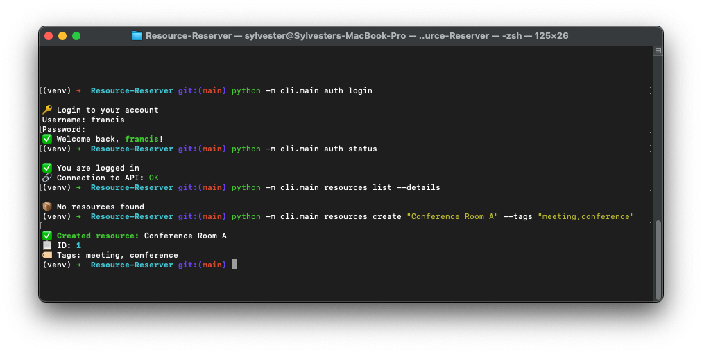
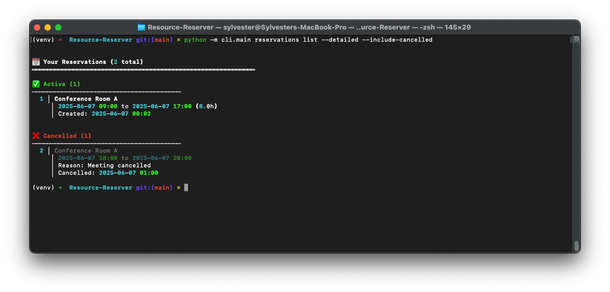

# Resource Reservation System

## Overview

The Resource Reservation System is a robust, scalable API service designed to manage and schedule shared resources within an organization. This system provides a structured approach to resource allocation, enabling users to book, manage, and track the usage of various resources while maintaining a clear audit trail of all transactions.

## Key Features

- **User Authentication & Authorization**: Secure access control with JWT-based authentication
- **Resource Management**: Create, list, and search available resources with tag-based categorization
- **Intelligent Booking System**: Make, modify, and cancel reservations with conflict prevention
- **Comprehensive History**: Track all reservation changes and maintain a complete audit log
- **Bulk Operations**: Import multiple resources via CSV upload
- **Professional CLI Interface**: Rich, interactive command-line interface with color-coded output
- **RESTful API**: Clean, well-documented endpoints following REST principles
- **CORS Support**: Ready for web application integration

## Technical Architecture

### Backend Stack

- **Framework**: FastAPI (Python 3.7+)
- **Database**: SQLite (Production-ready for PostgreSQL/MySQL)
- **Authentication**: JWT (JSON Web Tokens)
- **API Documentation**: Auto-generated OpenAPI/Swagger UI

### Data Models

1. **Users**
   - Secure authentication with bcrypt password hashing
   - Reservation history tracking

2. **Resources**
   - Unique identification with availability status
   - Tag-based categorization for easy searching

3. **Reservations**
   - Time-bound bookings with status tracking
   - Duration calculation and conflict detection

4. **Audit Log**
   - Complete history of changes with user actions tracking
   - Timestamped records for accountability

## API Endpoints

### Authentication

- `POST /register` - Register a new user account
- `POST /token` - Obtain access token (login)

### Resources

- `POST /resources` - Create a new resource
- `GET /resources` - List all resources
- `GET /resources/search` - Search resources with filters
- `POST /resources/upload` - Upload multiple resources via CSV

### Reservations

- `POST /reservations` - Create a new reservation
- `GET /reservations/my` - View user's reservations
- `POST /reservations/{reservation_id}/cancel` - Cancel a reservation
- `GET /reservations/{reservation_id}/history` - View reservation history

### System

- `GET /health` - Health check endpoint

## Command Line Interface (CLI)

The system includes a powerful CLI built with Typer, providing an intuitive command-line interface for interacting with the Resource Reservation System. The CLI offers rich terminal formatting, interactive prompts, and comprehensive functionality.



### Key CLI Features

- **Interactive Authentication**: Secure login/logout with persistent token management
- **Resource Management**: List, search, create, and upload resources
- **Reservation Handling**: Create, view, cancel, and track reservations
- **Advanced Search**: Find available resources with flexible time-based filtering
- **Rich Output**: Color-coded and formatted terminal output with emojis
- **Bulk Upload**: CSV file upload with preview and error reporting
- **Comprehensive History**: Detailed audit trails for all actions

### CLI Commands Overview

#### Authentication Commands

```bash
# Register a new user
python -m cli.main auth register

# Login
python -m cli.main auth login

# Check authentication status
python -m cli.main auth status

# Logout
python -m cli.main auth logout
```

#### Resource Management

```bash
# List all resources with details
python -m cli.main resources list --details

# Search for available resources in a time window
python -m cli.main resources search --query "conference" --from "2025-06-07 09:00" --until "2025-06-07 17:00"

# Create a new resource
python -m cli.main resources create "Conference Room A" --tags "meeting,conference"

# Upload resources from CSV with preview
python -m cli.main resources upload resources.csv --preview
```


#### Reservation Management

```bash
# Create a reservation with duration
python -m cli.main reservations create 1 "2025-06-07 14:00" "2h"

# List your reservations
python -m cli.main reservations list --upcoming --detailed

# List all reservations including cancelled ones
python -m cli.main reservations list --include-cancelled --detailed
```


```bash
# Cancel a reservation with reason
python -m cli.main reservations cancel 2 --reason "Meeting cancelled"

# View reservation history
python -m cli.main reservations history 2 --detailed
```



#### Quick Actions

```bash
# Quick reserve with duration
python -m cli.main reserve 1 "2025-06-07 14:00" "2h"

# Show upcoming reservations
python -m cli.main upcoming
```


#### Smart Search and Booking

The CLI includes intelligent search that can help you find available resources and make reservations interactively:


#### System Commands

```bash
# Check system status and connectivity
python -m cli.main system status

# Show current configuration
python -m cli.main system config
```

## Getting Started

### Prerequisites

- Python 3.7+
- pip (Python package manager)
- SQLite (included with Python)

### Installation

1. Clone the repository:

   ```bash
   git clone https://github.com/sylvester-francis/Resource-Reserver.git
   cd Resource-Reserver
   ```

2. Create and activate a virtual environment:

   ```bash
   python -m venv venv
   source venv/bin/activate  # On Windows: venv\Scripts\activate
   ```

3. Install dependencies:

   ```bash
   pip install -r requirements.txt
   ```

4. Set up environment variables:

   ```bash
   cp .env.example .env
   # Edit .env with your configuration
   ```

5. Initialize the database:

   ```bash
   python -m app.database
   ```

### Running the Application

1. Start the FastAPI development server:

   ```bash
   uvicorn app.main:app --reload
   ```


1. The API will be available at `http://localhost:8000`
   - Swagger UI: `http://localhost:8000/docs`
   - ReDoc: `http://localhost:8000/redoc`

1. Use the CLI to interact with the system:

   ```bash
   # First, register and login
   python -m cli.main auth register
   python -m cli.main auth login
   
   # Then start using the system
   python -m cli.main resources list
   python -m cli.main upcoming
   ```

## Configuration

Create a `.env` file in the root directory with the following variables:

```env
# Database Configuration
DATABASE_URL=sqlite:///./reservations.db

# Authentication
SECRET_KEY=your-secret-key-change-in-production
ALGORITHM=HS256
ACCESS_TOKEN_EXPIRE_MINUTES=30

# API Configuration
API_URL=http://localhost:8000
```

### Environment Variables

- `DATABASE_URL`: Connection string for the database (defaults to SQLite)
- `SECRET_KEY`: Secret key for JWT token generation (change in production!)
- `ALGORITHM`: Algorithm for JWT (default: HS256)
- `ACCESS_TOKEN_EXPIRE_MINUTES`: Token expiration time in minutes (default: 30)
- `API_URL`: Base URL for the API (used by the CLI)

For production, make sure to:

1. Change the `SECRET_KEY` to a strong, random value
2. Use a production database like PostgreSQL
3. Set appropriate token expiration times

## Interactive API Documentation

Interactive API documentation is automatically available at:

- Swagger UI: `http://localhost:8000/docs`
- ReDoc: `http://localhost:8000/redoc`

## Security Features

- **Password Hashing**: bcrypt with proper salting
- **JWT Authentication**: Secure token-based authentication
- **Input Validation**: Comprehensive Pydantic schemas
- **SQL Injection Protection**: SQLAlchemy ORM usage
- **Authorization Checks**: User-specific resource access
- **CORS Protection**: Configurable cross-origin settings

## Deployment

For production deployment, consider:

1. Using a production-grade ASGI server (e.g., Uvicorn with Gunicorn)
2. Setting up a PostgreSQL database
3. Configuring proper HTTPS/TLS
4. Setting up monitoring and logging
5. Implementing rate limiting

## License

This project is licensed under the MIT License - see the [LICENSE](LICENSE) file for details.

## Contributing

1. Fork the repository
2. Create your feature branch (`git checkout -b feature/AmazingFeature`)
3. Commit your changes (`git commit -m 'Add some AmazingFeature'`)
4. Push to the branch (`git push origin feature/AmazingFeature`)
5. Open a Pull Request

## Support

For support, please open an issue on the GitHub repository.

---

*This project demonstrates a complete resource reservation system with both programmatic (API) and interactive (CLI) interfaces, showcasing modern Python development practices with FastAPI, SQLAlchemy, and Typer.*
