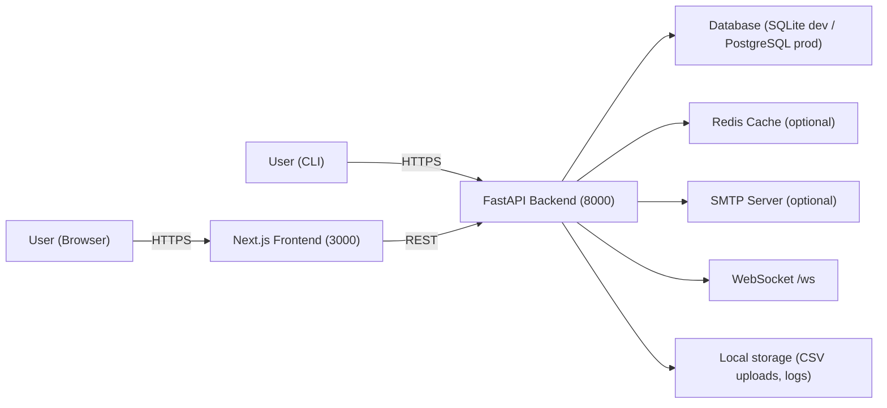
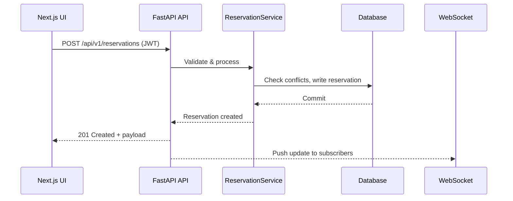

# Resource Reserver

Resource scheduling platform with conflict-aware reservations, waitlists, notifications, MFA/RBAC security, real-time updates, and both web and CLI access. Built with FastAPI, Next.js, PostgreSQL/SQLite, Redis caching, Alembic migrations, and Playwright/Vitest tests.

## Contents

- Overview
- Core Capabilities
- Architecture (Mermaid)
- Repository Layout
- Run the Stack (Docker)
- Run Locally (Backend, Frontend, CLI)
- Configuration
- How to Use (Web, CLI, API)
- Data & Imports
- Testing
- Deployment & Operations
- Troubleshooting
- License

______________________________________________________________________

## Overview

For non-technical readers: Resource Reserver prevents double-booking of shared assets (rooms, equipment, labs). Users browse availability, book or cancel, join waitlists, and receive reminders. Admins manage roles, approvals, business hours, blackout dates, analytics, quotas, webhooks, and audit logs.

For technical readers: The backend exposes versioned REST endpoints with JWT auth, TOTP MFA, rate limiting, WebSockets, and Redis caching. The frontend is a Next.js app consuming the same API. A Typer-based CLI wraps common workflows. Docker Compose brings up backend, frontend, and Redis; SQLite is default, PostgreSQL is optional.

______________________________________________________________________

## Core Capabilities

- **Reservations**: Conflict detection, recurring series, cancellation, history.
- **Resources**: Search/filter, status and maintenance with auto-reset, CSV upload.
- **Waitlist**: Join/leave, accept offers, track positions.
- **Security**: JWT auth, TOTP MFA, RBAC roles, OAuth2 client support.
- **Real-time**: WebSocket channel for live updates and notification center.
- **Calendar & Email**: iCal feeds (.ics), single-event export, SMTP notifications.
- **Operations**: Health/readiness/live, Prometheus metrics, rate limits/quotas, audit logs.
- **Integrations**: Webhooks with HMAC signing and retry; analytics CSV exports.

______________________________________________________________________

## Architecture

### Component View



### Reservation Flow



______________________________________________________________________

## Repository Layout

```
app/             FastAPI backend (routers, services, models)
frontend-next/   Next.js frontend (pages, components, e2e tests)
cli/             Typer-based CLI
docs/            MkDocs site
docker-compose.yml, Dockerfile.*   Container definitions
tests/           Backend tests
demo-resources.csv, resources.csv  Sample data
```

______________________________________________________________________

## Run the Stack (Docker)

Prerequisites: Docker + Docker Compose.

```bash
git clone https://github.com/sylvester-francis/Resource-Reserver.git
cd Resource-Reserver
docker compose up -d                 # backend, frontend, redis (SQLite default)
# docker compose down                # stop
```

Service URLs:

- Web UI: http://localhost:3000
- API + Swagger UI: http://localhost:8000 (docs at /docs)
- Health: /health, /ready, /live
- Metrics: http://localhost:8000/metrics

PostgreSQL profile (optional):

```bash
docker compose --profile postgres up -d
```

Dev hot-reload profile:

```bash
docker compose --profile dev up -d    # backend-dev on 8001, frontend-dev on 3001
```

### Using mise (optional)

If you have [mise](https://mise.jdx.dev/) installed, the common tasks are wrapped as simple commands:

```bash
mise run up           # start backend, frontend, redis (SQLite default)
mise run down         # stop services
mise run dev          # dev profile with hot reload (backend-dev:8001, frontend-dev:3001)
mise run test         # run test suite(s)
mise run lint         # run linters
mise run docs         # serve MkDocs site (if needed)
```

______________________________________________________________________

## Run Locally (without Docker)

Prerequisites: Python 3.11+, Node 20+ (npm) or Bun, Redis optional, SQLite default or PostgreSQL.

### Backend

```bash
python -m venv venv
source venv/bin/activate
pip install -r requirements.txt
cp .env.example .env    # set SECRET_KEY, DATABASE_URL, etc.
uvicorn app.main:app --reload --host 0.0.0.0 --port 8000
```

### Frontend

```bash
cd frontend-next
npm ci                  # or bun install
echo "NEXT_PUBLIC_API_URL=http://localhost:8000" > .env.local
npm run dev             # or bun run dev
```

### CLI

```bash
pip install -e .
resource-reserver-cli auth register
resource-reserver-cli auth login
resource-reserver-cli system status
```

______________________________________________________________________

## Configuration

Backend `.env` (copy from `.env.example`):

| Variable                          | Purpose                       | Example                          |
| --------------------------------- | ----------------------------- | -------------------------------- |
| DATABASE_URL                      | SQLite or Postgres connection | `sqlite:///./reservations.db`    |
| SECRET_KEY                        | JWT signing key               | `change-me`                      |
| ALGORITHM                         | JWT algorithm                 | `HS256`                          |
| ACCESS_TOKEN_EXPIRE_MINUTES       | Access token lifetime         | `30`                             |
| REDIS_URL                         | Redis connection              | `redis://localhost:6379/0`       |
| CACHE_ENABLED                     | Toggle Redis cache            | `true`                           |
| EMAIL_ENABLED                     | Toggle SMTP notifications     | `false`                          |
| SMTP_HOST/PORT/USER/PASSWORD/FROM | SMTP settings                 | `smtp.example.com` / `587` / ... |
| DEBUG                             | Dev mode flag                 | `true`                           |

Frontend `.env.local`:

```
NEXT_PUBLIC_API_URL=http://localhost:8000
```

______________________________________________________________________

## How to Use

### Web UI

- Register/login, enable MFA, manage roles (admin).
- Browse/search resources, upload CSVs, toggle availability/maintenance.
- Create single or recurring reservations; view history; cancel.
- Join/leave waitlist; accept offers.
- View notifications; download iCal feeds (.ics).

### CLI (examples)

```bash
resource-reserver-cli auth register
resource-reserver-cli auth login
resource-reserver-cli resources list
resource-reserver-cli resources search --query "room"
resource-reserver-cli reservations create <resource_id> <start> <end>
resource-reserver-cli reservations cancel <reservation_id>
resource-reserver-cli waitlist join --resource <id> --start <ts> --end <ts>
resource-reserver-cli system status
```

### API

- Swagger/OpenAPI: http://localhost:8000/docs
- Auth flow: `POST /api/v1/register` -> `POST /api/v1/token` -> use `Authorization: Bearer <token>`
- Key families:
  - Resources: `/api/v1/resources`, `/api/v1/resources/search`, `/api/v1/resources/upload`, status/availability endpoints
  - Reservations: `/api/v1/reservations`, `/recurring`, `/my`, `/history`, `/cancel`
  - Waitlist: `/api/v1/waitlist/*`
  - Notifications: `/api/v1/notifications/*`
  - Calendar: `/api/v1/calendar/*` (subscription URL, .ics export)
  - Business hours/blackouts: `/api/v1/resources/{id}/business-hours`, `/blackout-dates`
  - Analytics: `/api/v1/analytics/*`
  - Webhooks: `/api/v1/webhooks/*`
  - Quotas/rate limits: `/api/v1/quotas/*`
  - Audit: `/api/v1/audit/*`
  - Admin cleanup: `/api/v1/admin/cleanup-expired`

______________________________________________________________________

## Data & Imports

- Sample CSVs: `demo-resources.csv`, `resources.csv`.
- Import resources via Web UI upload or `POST /api/v1/resources/upload` (CSV).
- Business hours and blackout dates via respective endpoints.
- Calendar exports: `/api/v1/calendar/subscription-url` (tokenized feed) and `/api/v1/calendar/export/{reservation_id}.ics`.

______________________________________________________________________

## Testing

Backend:

```bash
pytest tests/ -v
```

Frontend:

```bash
cd frontend-next
npm run test          # Vitest
```

E2E (Playwright):

```bash
cd frontend-next
npm run test:e2e
# install browsers once:
npx playwright install chromium --with-deps
```

Coverage (backend):

```bash
pytest --cov=app --cov=cli
```

______________________________________________________________________

## Deployment & Operations

- Compose: `docker compose up -d`
- Migrations: `alembic upgrade head`
- Health: `GET /health`, readiness `/ready`, liveness `/live`
- Metrics: `GET /metrics` (Prometheus)
- Rate limits/quotas: `/api/v1/quotas/*`
- Admin cleanup: `POST /api/v1/admin/cleanup-expired`

Production tips: use PostgreSQL, set a strong `SECRET_KEY`, enable HTTPS at the reverse proxy, configure SMTP if email is required.

______________________________________________________________________

## Troubleshooting

- Authentication errors: verify `SECRET_KEY` and token expiry; refresh via `/api/v1/token/refresh`.
- 401/403 from frontend: check `NEXT_PUBLIC_API_URL`, CORS, and auth cookies.
- SQLite locking: switch to PostgreSQL (`--profile postgres`).
- Emails not sending: set `EMAIL_ENABLED=true` and valid SMTP credentials.
- Playwright failures: install browsers (`npx playwright install`) and ensure backend/frontend are running.

______________________________________________________________________

## License

MIT License (see `LICENSE`).
