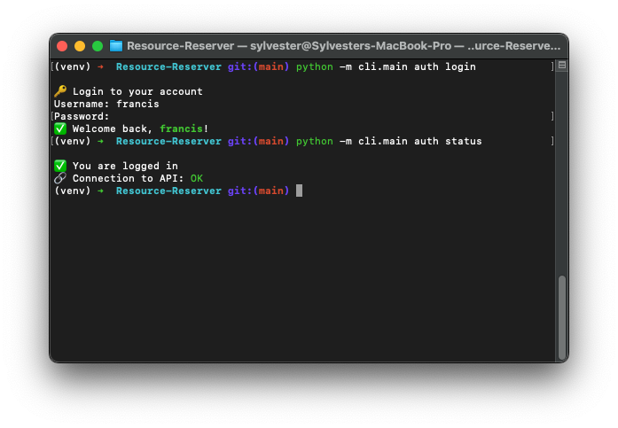
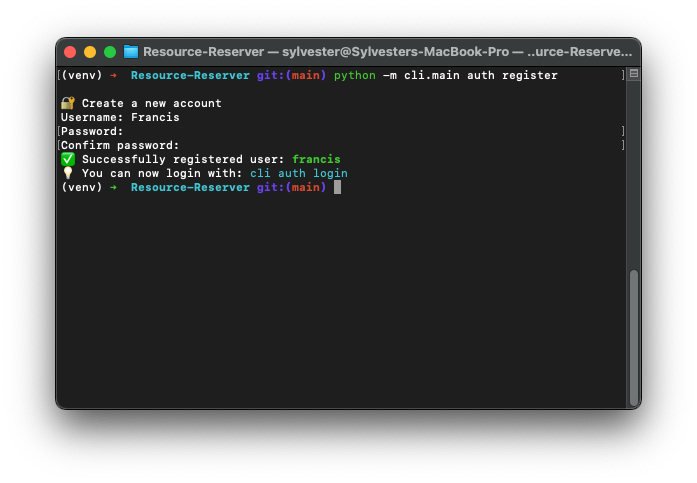
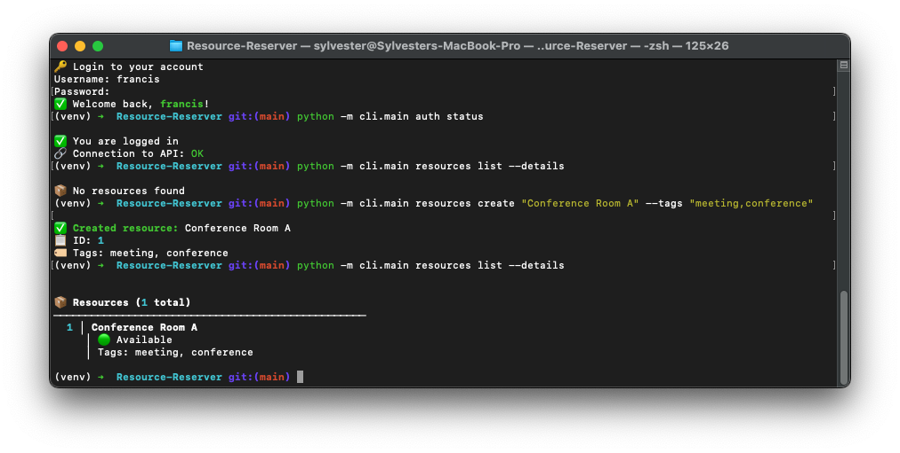
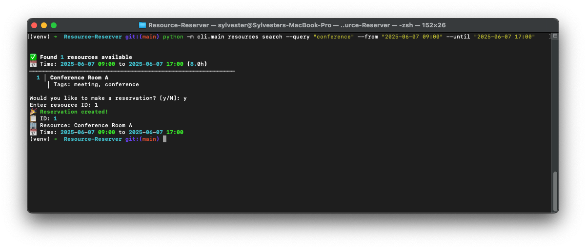
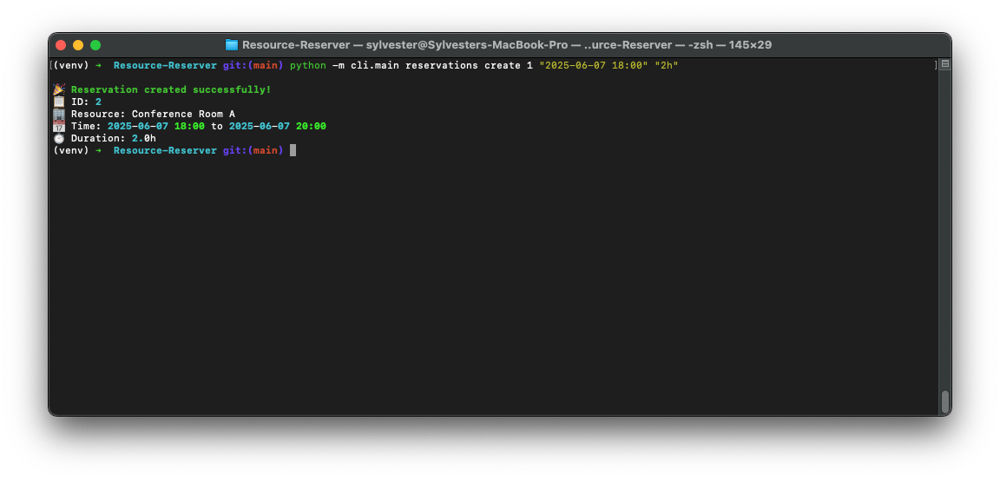
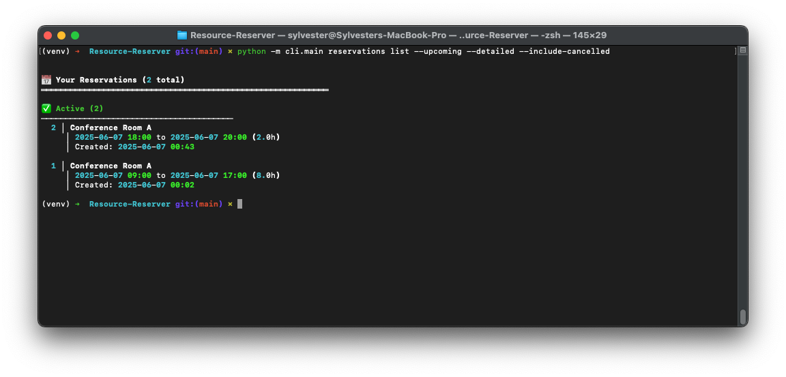
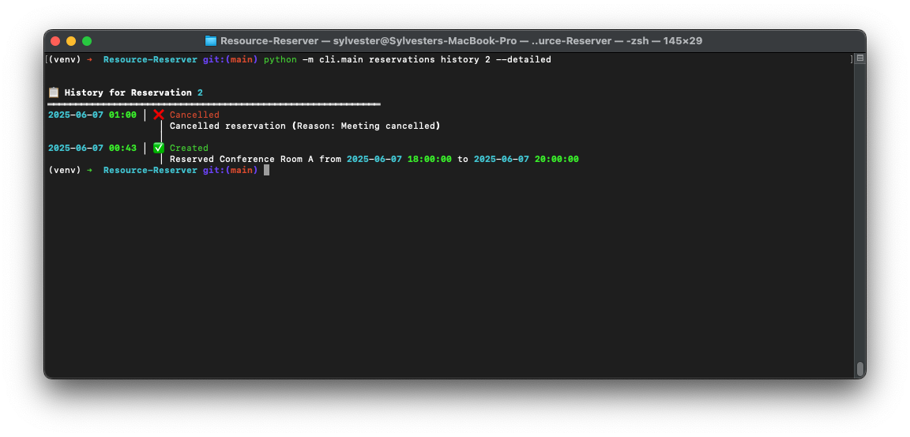
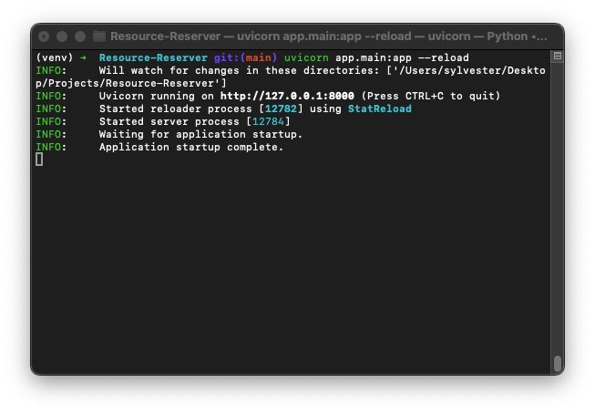
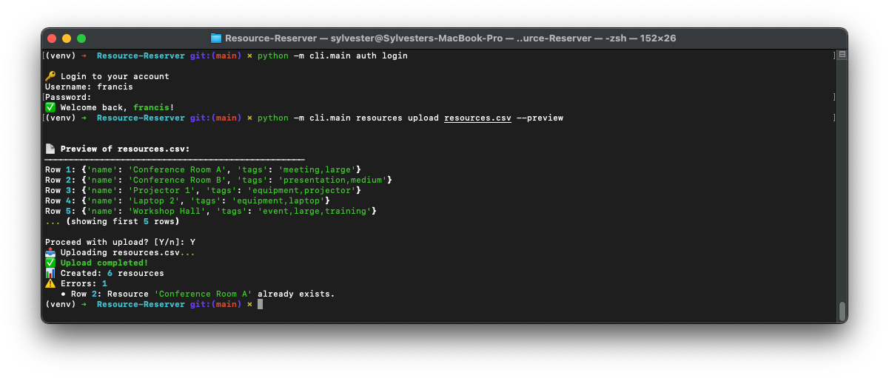

# 📅 Resource Reservation System

[](LICENSE)
[](https://www.python.org/)
[](https://fastapi.tiangolo.com/)
[](https://typer.tiangolo.com/)
[](http://localhost:8000/docs)

---

## 🧭 Overview

The **Resource Reservation System** is a scalable API + CLI tool that helps organizations manage and schedule shared resources such as meeting rooms or lab equipment. It ensures conflict-free bookings, keeps a complete audit trail, and provides a modern command-line experience.

---

## 🚀 Key Features

- 🔐 **JWT Authentication & Authorization**
- 🗂️ **Tag-Based Resource Management**
- 📅 **Smart Booking System with Conflict Detection**
- 📊 **Complete Audit Trail**
- 📥 **CSV Bulk Resource Import**
- 🖥️ **Modern Typer CLI with Rich Output**
- 🌐 **RESTful API with Swagger/OpenAPI Docs**
- 🌍 **CORS-Enabled for Web Integration**

---

## 🏗️ Technical Architecture

### ⚙️ Backend Stack

- **Framework**: FastAPI (Python 3.7+)
- **Database**: SQLite (switchable to PostgreSQL/MySQL)
- **Auth**: JWT
- **Docs**: Auto-generated Swagger / ReDoc

### 🧩 Data Models

- **Users**: Secure credentials, login history
- **Resources**: Categorized by tags and availability
- **Reservations**: Conflict-checked time slots
- **Audit Logs**: User actions and changes with timestamps

---

## 📡 API Endpoints

### 🔑 Authentication

- `POST /register` - Register new user  
- `POST /token` - Login and get token

### 🧾 Resources

- `POST /resources` - Create resource  
- `GET /resources` - List all  
- `GET /resources/search` - Filter by tags or time  
- `POST /resources/upload` - Bulk upload (CSV)

### 📆 Reservations

- `POST /reservations` - Book a resource  
- `GET /reservations/my` - View user’s bookings  
- `POST /reservations/{id}/cancel` - Cancel  
- `GET /reservations/{id}/history` - Track changes

### ⚙️ System

- `GET /health` - Health check

---

## 💻 Command Line Interface (CLI)

Built with **Typer**, the CLI offers an intuitive, emoji-enhanced interface.

### 🎯 Highlights

- 🔐 Secure authentication (login/logout/status)
- 🧾 Resource operations (list, create, search, bulk upload)
- 📆 Reservation control (book, cancel, view history)
- ⌛ Smart availability search with conflict detection
- 📦 CSV support with preview and error highlighting
- 🧠 Audit logs with full traceability

---

## 🔧 CLI Usage Examples

### 🔐 Authentication

```bash
python -m cli.main auth register
python -m cli.main auth login
python -m cli.main auth status
python -m cli.main auth logout
```

### 🧾 Resource Management

```bash
python -m cli.main resources list --details
python -m cli.main resources search --query "conference" --from "2025-06-07 09:00" --until "2025-06-07 17:00"
python -m cli.main resources create "Conference Room A" --tags "meeting,conference"
python -m cli.main resources upload resources.csv --preview
```

### 📆 Reservations

```bash
python -m cli.main reservations create 1 "2025-06-07 14:00" "2h"
python -m cli.main reservations list --upcoming --detailed
python -m cli.main reservations cancel 2 --reason "Meeting cancelled"
python -m cli.main reservations history 2 --detailed
```

### ⚡ Quick Actions

```bash
python -m cli.main reserve 1 "2025-06-07 14:00" "2h"
python -m cli.main upcoming
```

### 🧠 System Status

```bash
python -m cli.main system status
python -m cli.main system config
```

> ### 📸 Application Screenshots
> 
> | Feature | Screenshot |
> |---------|------------|
> | **User Authentication** |  |
> | **User Registration** |  |
> | **Resource Management** |  |
> | **Smart Search** |  |
> | **Reservation Creation** |  |
> | **Reservation History** |  |
> | **Upcoming Reservations** |  |
> | **Server Status** |  |
> | **Bulk Upload** |  |

---

## 🛠️ Getting Started

### ✅ Prerequisites

- Python 3.7+
- `pip` installed
- SQLite (default)

### 📥 Installation

```bash
git clone https://github.com/sylvester-francis/Resource-Reserver.git
cd Resource-Reserver
python -m venv venv
source venv/bin/activate  # or venv\Scripts\activate on Windows
pip install -r requirements.txt
cp .env.example .env  # Edit as needed
python -m app.database  # Initialize DB
```

### ▶️ Run the App

```bash
uvicorn app.main:app --reload
# Visit: http://localhost:8000/docs
```

---

## ⚙️ Configuration

`.env` example:

```env
DATABASE_URL=sqlite:///./reservations.db
SECRET_KEY=your-secret-key
ALGORITHM=HS256
ACCESS_TOKEN_EXPIRE_MINUTES=30
API_URL=http://localhost:8000
```

---

## 📚 Documentation

- Swagger UI → `/docs`  
- ReDoc → `/redoc`

---

## 🔐 Security Features

- ✅ **bcrypt** password hashing  
- ✅ **JWT** for secure sessions  
- ✅ **Pydantic** for strict validation  
- ✅ **SQLAlchemy** ORM (safe from injection)  
- ✅ **CORS** headers  
- ✅ **User-scoped access controls**

---

## 🚀 Deployment Tips

- Run with Gunicorn & Uvicorn workers  
- Use PostgreSQL or MySQL in prod  
- Set a strong `SECRET_KEY`  
- Serve over HTTPS  
- Enable logging, monitoring, and rate limiting

---

## 📄 License

MIT © [Sylvester Francis](https://github.com/sylvester-francis)

---

## 🤝 Contributing

1. Fork this repo  
2. Create a branch `git checkout -b feature/YourFeature`  
3. Commit `git commit -m 'feat: Add YourFeature'`  
4. Push `git push origin feature/YourFeature`  
5. Open a Pull Request 🎉

---

## 🆘 Support

Found a bug? [Open an issue](https://github.com/sylvester-francis/Resource-Reserver/issues)

---

> ✨ This project is an end-to-end showcase of modern Python backend + CLI tooling using FastAPI, SQLAlchemy, and Typer. Clean code. Strong architecture. Ready for production.
