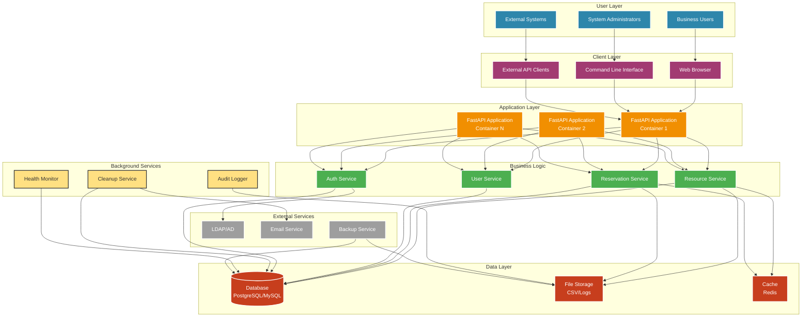
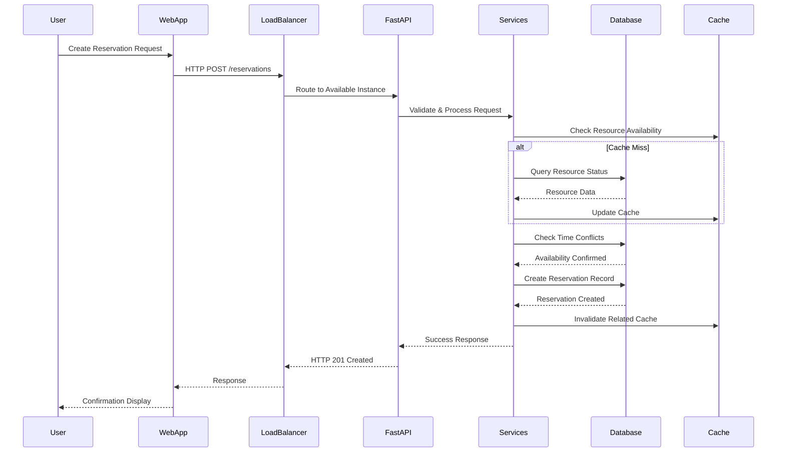
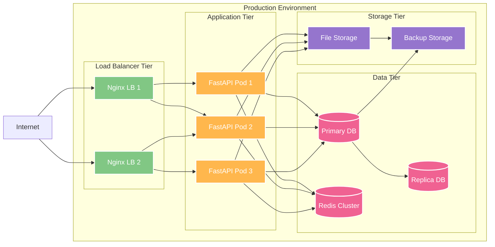
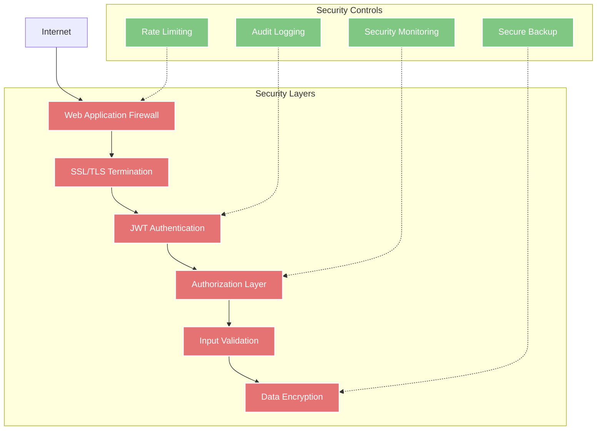

# System Architecture

## High-Level Architecture

## Component Details

### Client Layer
- **Web Browser**: React/Vue.js SPA or vanilla JavaScript interface
- **CLI Interface**: Typer-based command-line tool with rich output
- **API Clients**: External systems integrating via REST API

### Application Layer
- **FastAPI Applications**: Horizontally scalable Python web services
- **Load Balancer**: Nginx for SSL termination and request distribution
- **Auto-scaling**: Container orchestration with Docker/Kubernetes

### Business Logic
- **Resource Service**: CRUD operations for organizational resources
- **Reservation Service**: Booking logic with conflict detection
- **User Service**: Account management and authentication
- **Auth Service**: JWT token management and authorization

### Data Layer
- **Primary Database**: PostgreSQL/MySQL for transactional data
- **File Storage**: Local/cloud storage for CSV imports and logs
- **Cache**: Redis for session storage and performance optimization

### Background Services
- **Cleanup Service**: Automated removal of expired reservations
- **Health Monitor**: System status and performance metrics
- **Audit Logger**: Compliance and activity tracking

## Data Flow Architecture

## Deployment Architecture

## Security Architecture

