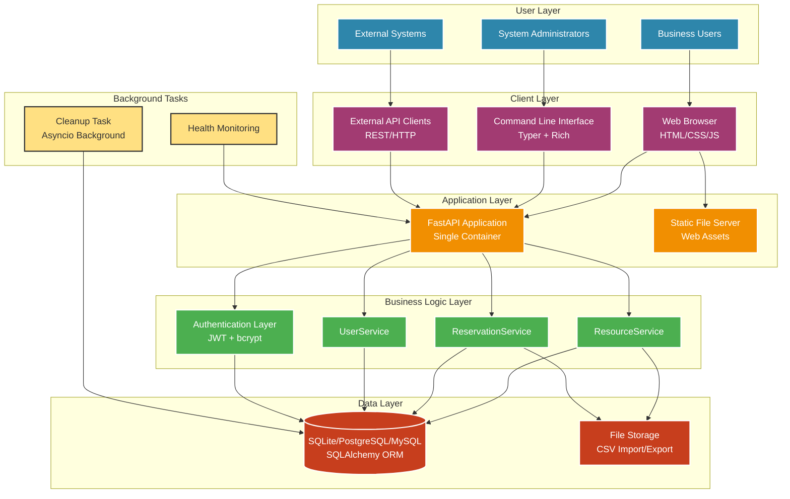
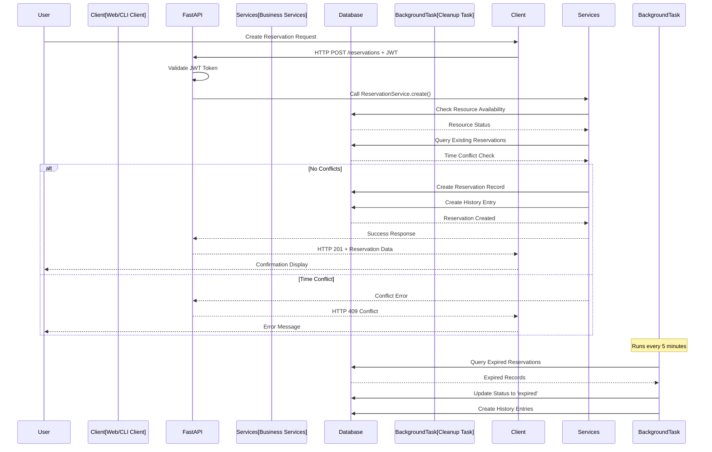
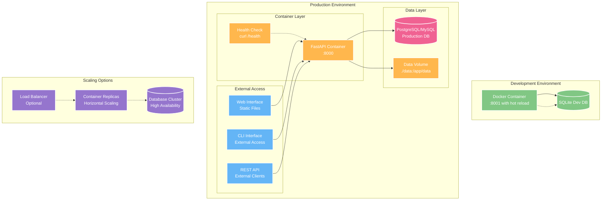
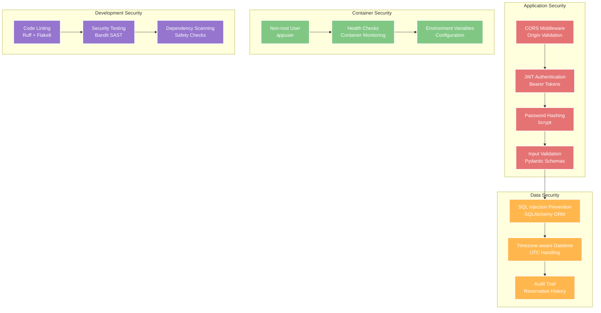

# System Architecture

## High-Level Architecture



## Component Details

### Client Layer
- **Web Browser**: Vanilla JavaScript interface with HTML/CSS frontend served as static files
- **CLI Interface**: Typer-based command-line tool with Rich formatting and interactive features
- **API Clients**: External systems integrating via REST API with JWT authentication

### Application Layer
- **FastAPI Application**: Single Python web service handling all API endpoints and web serving
- **Static File Server**: Integrated static file serving for web interface assets (HTML/CSS/JS)
- **CORS Middleware**: Cross-origin resource sharing for web client integration

### Business Logic Layer
- **ResourceService**: CRUD operations, availability checking, CSV import/export
- **ReservationService**: Booking logic with conflict detection and history tracking  
- **UserService**: User account creation and management
- **Authentication Layer**: JWT token generation/validation with bcrypt password hashing

### Data Layer
- **Database**: SQLAlchemy ORM with support for SQLite (dev), PostgreSQL/MySQL (prod)
- **File Storage**: Local filesystem for CSV import/export and application logs
- **Models**: SQLAlchemy models with proper relationships and timezone-aware datetime handling

### Background Tasks
- **Cleanup Task**: Asyncio background task for automatic expired reservation cleanup
- **Health Monitoring**: Built-in health check endpoints for container orchestration

## Data Flow Architecture



## Deployment Architecture



## Security Architecture



## Technology Stack

### Core Framework
- **FastAPI**: Modern Python web framework with automatic OpenAPI documentation
- **SQLAlchemy**: Database ORM with support for multiple database backends
- **Pydantic**: Data validation and serialization with type hints

### Authentication & Security
- **JWT (JSON Web Tokens)**: Stateless authentication with python-jose
- **bcrypt**: Secure password hashing algorithm
- **CORS**: Cross-origin resource sharing middleware

### CLI & User Interface
- **Typer**: Modern CLI framework built on Click
- **Rich**: Enhanced terminal output with colors and formatting
- **Vanilla JavaScript**: Frontend web interface without frameworks

### Development & Testing
- **pytest**: Python testing framework with fixtures and plugins
- **Ruff**: Fast Python linter and formatter
- **Docker**: Containerization for consistent deployments
- **GitHub Actions**: CI/CD pipeline with automated testing

### Database Support
- **SQLite**: Development and testing database
- **PostgreSQL**: Recommended production database
- **MySQL**: Alternative production database option

## File Structure

```
resource-reserver/
├── app/                          # FastAPI backend application
│   ├── main.py                   # Application entry point and endpoints
│   ├── models.py                 # SQLAlchemy database models
│   ├── schemas.py                # Pydantic request/response schemas
│   ├── services.py               # Business logic layer
│   ├── auth.py                   # Authentication and JWT handling
│   └── database.py               # Database configuration and session
├── cli/                          # Command-line interface
│   ├── main.py                   # CLI entry point with Typer commands
│   ├── client.py                 # API client for CLI operations
│   ├── config.py                 # CLI configuration management
│   └── utils.py                  # Utility functions for CLI
├── web/                          # Web interface static files
│   ├── index.html                # Single-page application
│   ├── css/styles.css            # Stylesheet
│   └── js/script.js              # Client-side JavaScript
├── tests/                        # Comprehensive test suite
│   ├── test_api/                 # API endpoint tests
│   ├── test_cli/                 # CLI command tests
│   └── test_services/            # Business logic tests
├── .github/workflows/            # CI/CD pipeline configuration
│   └── ci.yml                    # GitHub Actions workflow
├── docker-compose.yml            # Container orchestration
├── Dockerfile                    # Container image definition
├── pyproject.toml               # Python project configuration
└── requirements.txt             # Python dependencies
```

## Deployment Options

### Docker Compose (Recommended)
```bash
# Production deployment
docker compose up -d api

# Development with hot reload  
docker compose --profile dev up -d api-dev
```

### Manual Installation
```bash
# Install dependencies
pip install -r requirements.txt

# Run application
uvicorn app.main:app --host 0.0.0.0 --port 8000
```

### Environment Configuration
- **DATABASE_URL**: Database connection string
- **ENVIRONMENT**: Application environment (development/production)
- **CLI_CONFIG_DIR**: CLI configuration directory
- **PORT**: Application server port (default: 8000)