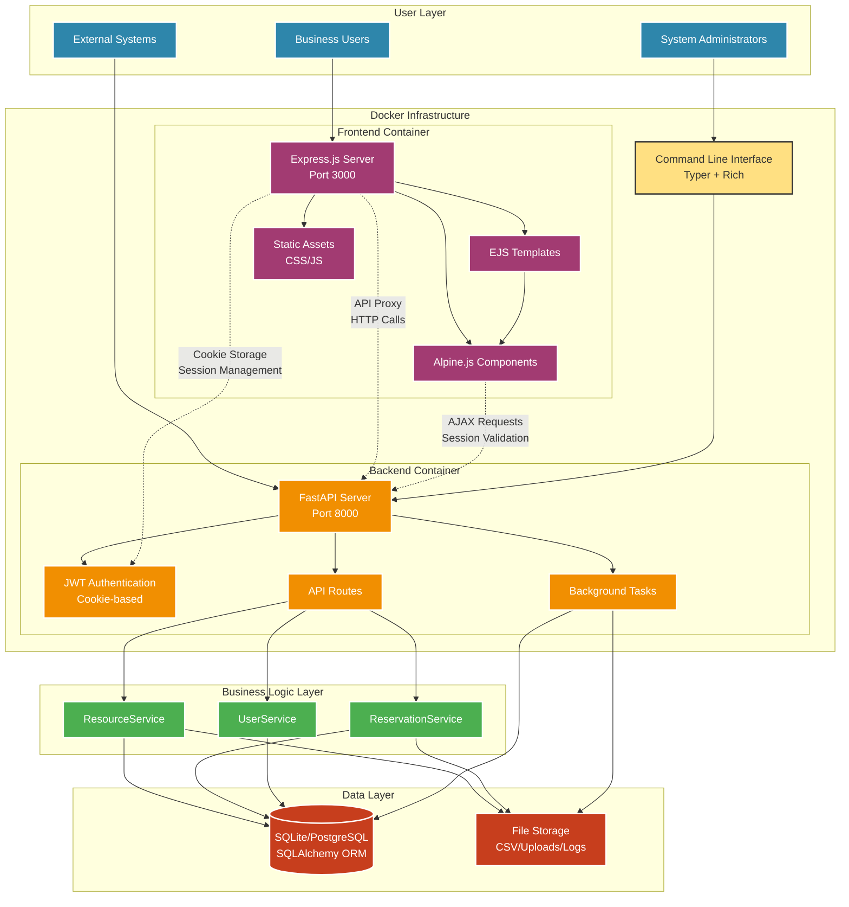
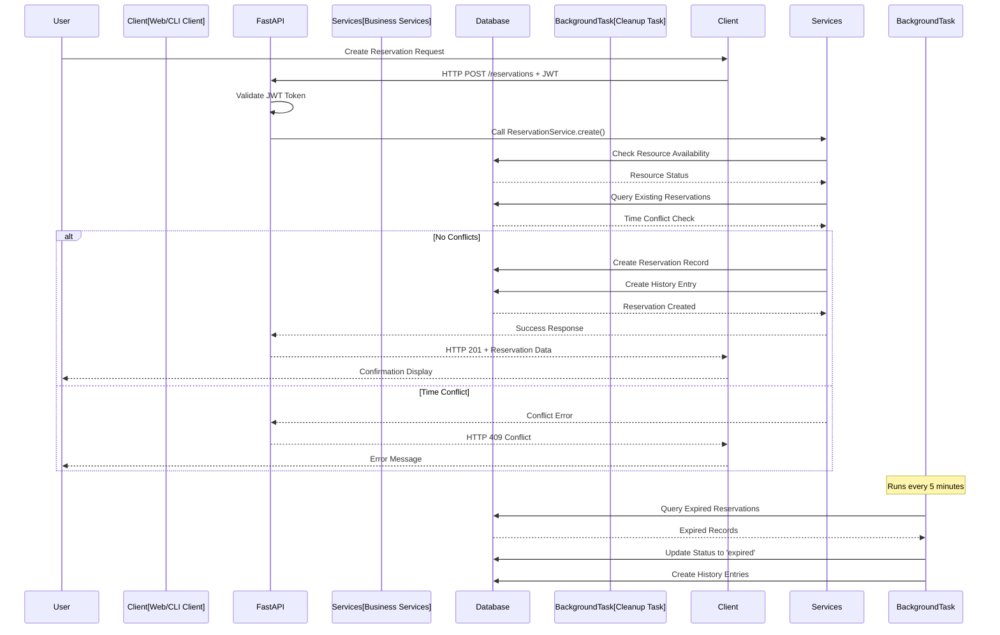
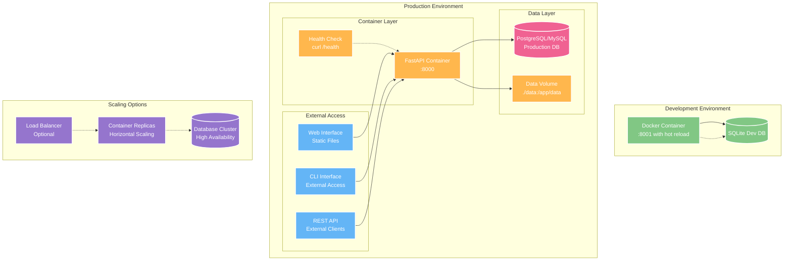
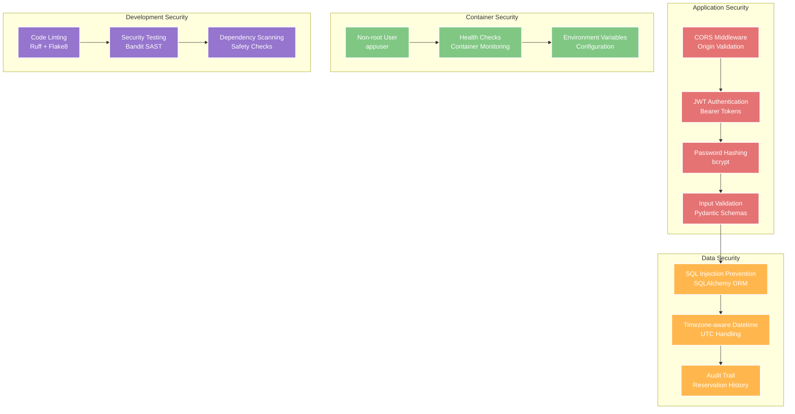

# System Architecture

## High-Level Architecture



## Component Details

### Frontend Container (Express.js + Alpine.js)
- **Express.js Server**: Server-side rendering with EJS templates and API proxy functionality
- **Alpine.js Components**: Lightweight reactive client-side interactions without build complexity
- **EJS Templates**: Clean, maintainable HTML generation with server-side data injection
- **Static Assets**: Direct serving of CSS and JavaScript files without compilation

### Backend Container (FastAPI)
- **FastAPI Application**: REST API service with automatic OpenAPI documentation
- **Cookie-based Authentication**: Secure session management with JWT tokens stored in HTTP-only cookies
- **API Routes**: Comprehensive endpoints for resources, reservations, and user management

### Business Logic Layer
- **ResourceService**: CRUD operations, availability checking, CSV import/export
- **ReservationService**: Booking logic with conflict detection and history tracking  
- **UserService**: User account creation and management
- **Authentication Layer**: JWT token generation/validation with bcrypt password hashing

### Data Layer
- **Database**: SQLAlchemy ORM with support for SQLite (dev), PostgreSQL/MySQL (prod)
- **File Storage**: Local filesystem for CSV import/export and application logs
- **Models**: SQLAlchemy models with proper relationships and timezone-aware datetime handling

### Background Tasks
- **Cleanup Task**: Asyncio background task for automatic expired reservation cleanup
- **Health Monitoring**: Built-in health check endpoints for container orchestration

## Data Flow Architecture



## Deployment Architecture



## Security Architecture



## Technology Stack

### Core Framework
- **FastAPI**: Modern Python web framework with automatic OpenAPI documentation
- **SQLAlchemy**: Database ORM with support for multiple database backends
- **Pydantic**: Data validation and serialization with type hints

### Authentication & Security
- **JWT (JSON Web Tokens)**: Stateless authentication with python-jose
- **bcrypt**: Secure password hashing algorithm
- **CORS**: Cross-origin resource sharing middleware

### Frontend & User Interface
- **Express.js**: Fast, minimalist web framework for Node.js with server-side rendering
- **EJS**: Embedded JavaScript templating for clean HTML generation  
- **Alpine.js**: Lightweight reactive framework for client-side interactions
- **Typer**: Modern CLI framework built on Click
- **Rich**: Enhanced terminal output with colors and formatting

### Development & Testing
- **pytest**: Python testing framework with fixtures and plugins
- **Ruff**: Fast Python linter and formatter
- **Docker**: Containerization for consistent deployments
- **GitHub Actions**: CI/CD pipeline with automated testing

### Database Support
- **SQLite**: Development and testing database
- **PostgreSQL**: Recommended production database
- **MySQL**: Alternative production database option

## File Structure

```
resource-reserver/
├── app/                          # FastAPI backend service
│   ├── main.py                   # Application entry point & API routes
│   ├── auth.py                   # JWT authentication logic
│   ├── database.py               # Database configuration & connection
│   ├── models.py                 # SQLAlchemy data models
│   ├── schemas.py                # Pydantic API schemas
│   └── services.py               # Business logic layer
├── frontend/                     # Express.js frontend service
│   ├── server.js                 # Express server with API proxy
│   ├── package.json              # Node.js dependencies
│   ├── views/                    # EJS templates
│   │   ├── dashboard.ejs         # Main application dashboard
│   │   ├── login.ejs             # Authentication pages
│   │   └── partials/             # Reusable template components
│   │       └── modals.ejs        # Modal dialogs
│   ├── public/                   # Static assets (served directly)
│   │   ├── css/                  # Stylesheets
│   │   │   └── styles.css        # Main application styles
│   │   └── js/                   # Client-side JavaScript
│   │       └── app.js            # Alpine.js application logic
│   └── uploads/                  # File upload storage
├── cli/                          # Command-line interface
│   ├── main.py                   # CLI entry point with Typer commands
│   ├── client.py                 # API client for CLI operations
│   ├── config.py                 # CLI configuration management
│   └── utils.py                  # Utility functions for CLI
├── tests/                        # Comprehensive test suite
│   ├── test_api/                 # API endpoint tests
│   ├── test_cli/                 # CLI command tests
│   └── test_services/            # Business logic tests
├── .github/workflows/            # CI/CD pipeline configuration
│   └── ci.yml                    # GitHub Actions workflow
├── Dockerfile.backend            # Backend container configuration
├── Dockerfile.frontend           # Frontend container configuration
├── docker-compose.yml            # Multi-service orchestration
├── requirements.txt              # Python dependencies
├── pyproject.toml                # Python project configuration
└── README.md                     # Complete documentation
```

## Deployment Options

### Docker Compose (Recommended)
```bash
# Production deployment (both services)
docker compose up -d backend frontend

# Development with hot reload  
docker compose --profile dev up -d

# Individual services
docker compose up -d backend  # FastAPI only
docker compose up -d frontend # Express.js only
```

### Manual Installation
```bash
# Backend setup
pip install -r requirements.txt
uvicorn app.main:app --reload --port 8000

# Frontend setup (separate terminal)
cd frontend
npm install
npm start
```

### Environment Configuration
- **DATABASE_URL**: Database connection string
- **ENVIRONMENT**: Application environment (development/production)
- **CLI_CONFIG_DIR**: CLI configuration directory
- **PORT**: Application server port (default: 8000)