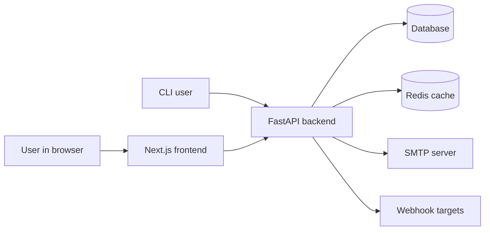
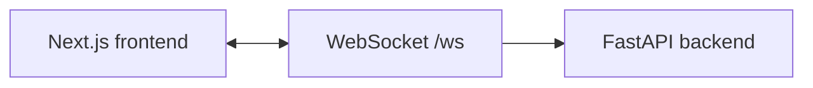
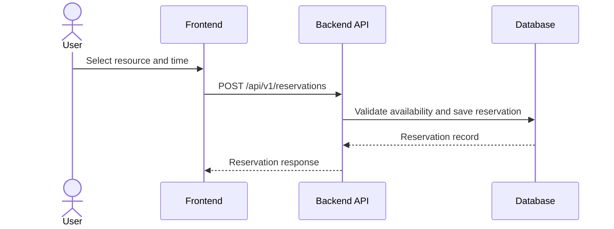

# Architecture

## System overview

```mermaid
flowchart LR
  User[User in browser] --> Web[Next.js frontend]
  CLI[CLI user] --> API[FastAPI backend]
  Web --> API
  API --> DB[(Database)]
  API --> Cache[(Redis cache)]
  API --> Mail[SMTP server]
  API --> Webhooks[Webhook targets]
```

## Real-time updates

```mermaid
flowchart LR
  Web[Next.js frontend] <--> WS[WebSocket /ws]
  WS --> API[FastAPI backend]
```

## Reservation flow

```mermaid
sequenceDiagram
  actor User
  participant UI as Frontend
  participant API as Backend API
  participant DB as Database

  User->>UI: Select resource and time
  UI->>API: POST /api/v1/reservations
  API->>DB: Validate availability and save reservation
  DB-->>API: Reservation record
  API-->>UI: Reservation response
```
